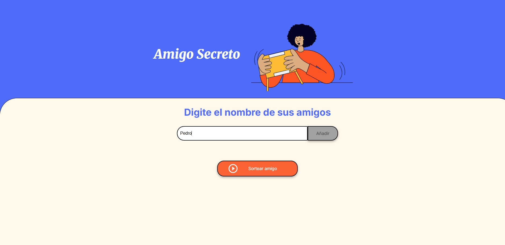
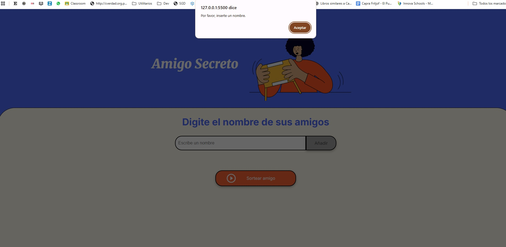

<h1 align="center"> Challenge Amigo Secreto - ALURA LATAM</h1>

 En este ejercicio, se desarrolló una aplicación que permite a los usuarios ingresar nombres de amigos en una lista para luego realizar un sorteo aleatorio y determinar quién es su "amigo secreto" sorteado. El usuario deberá agregar nombres mediante un campo de texto y un botón "Añadir". Los nombres ingresados se mostrarán en una lista en la página, y al finalizar, un botón "Sortear Amigo" seleccionará uno de los nombres de forma aleatoria, mostrando el resultado en pantalla.

## :hammer:Funcionalidades del proyecto
- `Agregar nombres`: Los usuarios pueden escribir el nombre de un amigo en el campo de texto y lo agregarán a una lista visible al hacer clic en "Añadir"
  
    
    
- `Validar entrada`: Si el campo de texto está vacío, se mostrará una alerta pidiendo un nombre válido.
  
   
    
- `Visualizar la lista`: Los nombres ingresados aparecerán en una lista debajo del campo de entrada.
- `Sorteo aleatorio`: Al hacer clic en el botón "Sortear Amigo", se seleccionará aleatoriamente un nombre de la lista y se mostrará en la página.

